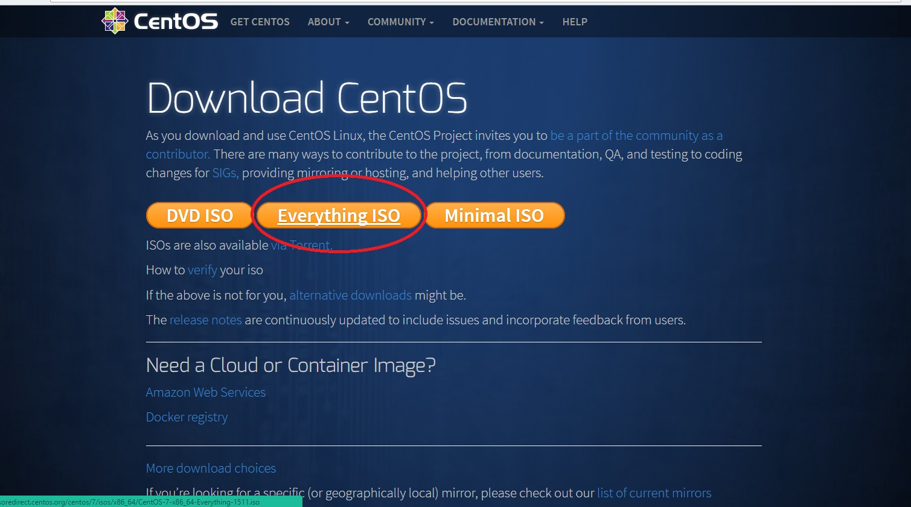
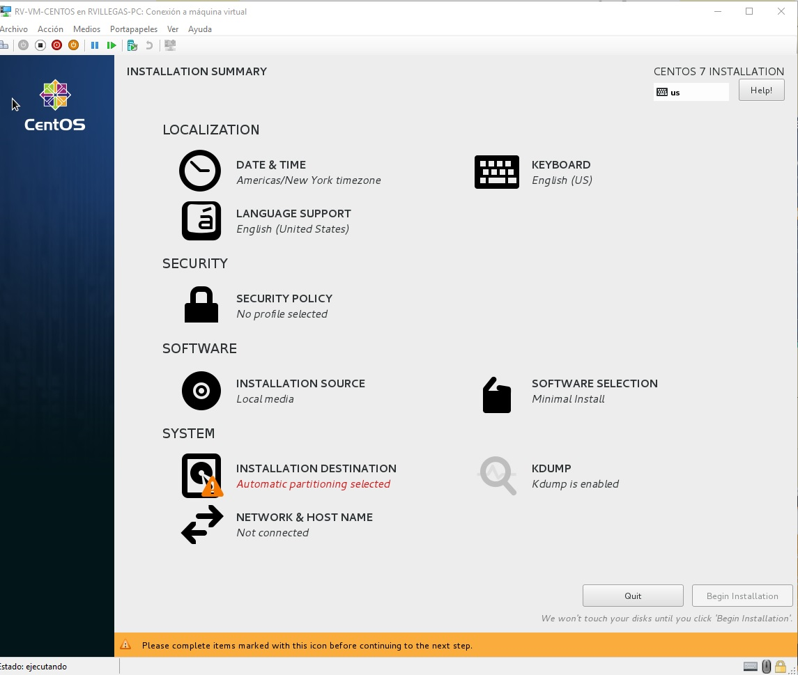
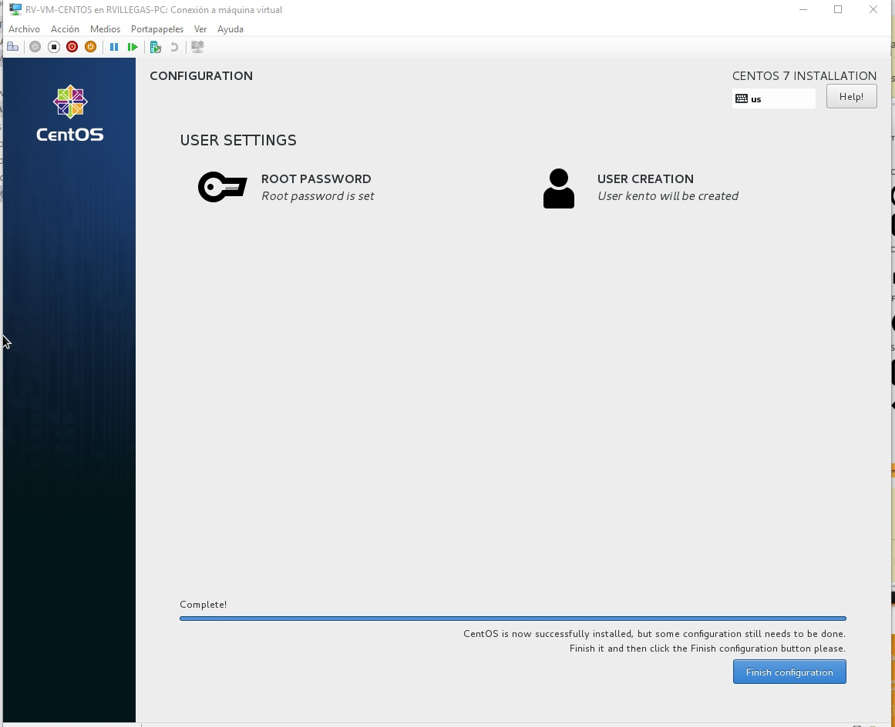
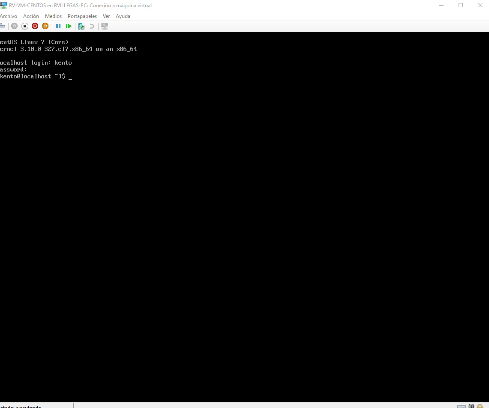
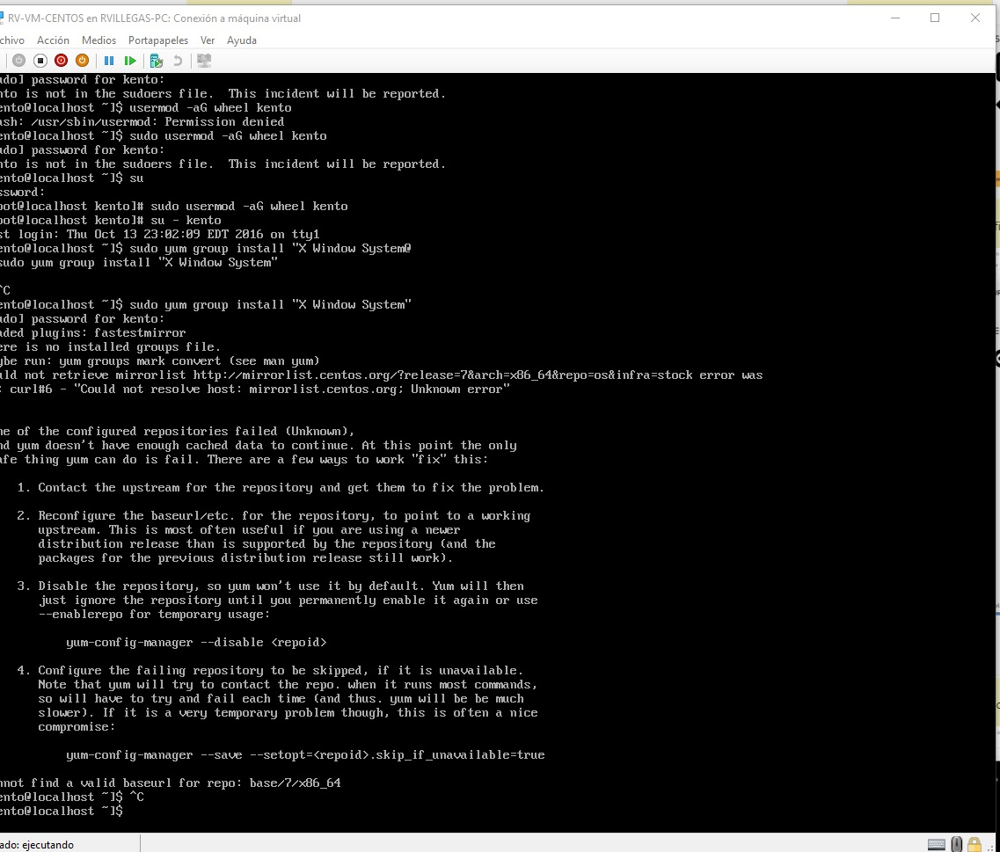
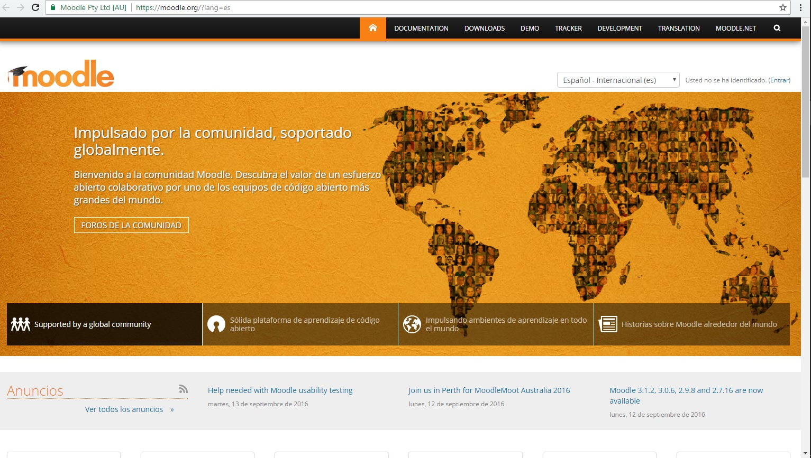

# Proyecto Final - Administración de Linux

## __Curso__

Administración de Linux

## __Integrantes__

* Robinson Kent Villegas Rojas

## __Introducción__

En este proyecto aprenderemos a instalar, configurar e implementar un Learning Management System (LMS) basado en
código abierto que genere y aumente la productividad de una empresa, que cubra los
siguientes aspectos, inherentes a los temas propios del curso:

* Instalación de un sistema operativo basado en Linux con la paquetería necesaria para su buen funcionamiento.

* Requisitos previos para la implementación de la aplicación LMS.

* Configuración de parámetros de red, almacenamiento y seguridad del sistema operativo Linux instalado.

* Implementación de la aplicación LMS que mejorará funcionamiento del negocio.

*¿Qué es y para qué sirve un LMS?*
---
Un LMS (Learning Management System) es un sistema de gestión de aprendizaje online, que permite administrar, distribuir, monitorear, evaluar y apoyar las diferentes actividades previamente diseñadas y programadas dentro de un proceso de formación completamente virtual (eLearning), o de formación semi-presencial (Blended Learning).

Centos
===
Usaremos la distribución(distro) de Linux llamada Centos para implementar el LMS.

Esta distro es una derivada de la distribución Red Hat Enterprise Linux RHEL, por lo cual se caracteriza por ser muy estable.

## Descarga

Podemos descargar la ultima versión desde [este enlace](https://www.centos.org/download/).

## Instalación

1. Para empezar habilitaremos una máquina virtual. En nuestro caso usaremos Hyper-V de Windows.
2. Bootearemos la VM desde la ISO que descargamos.
3. Seguimos las instrucciones y nos aparecerá esta ventana:

4. Nos pedira configurar el usuario root.

5. Una vez reiniciado nos aparecera esto:

6. Agregamos a nuestro usuario al grupo sudoers.

`su`

`sudo usermod -aG wheel kento`

7. Con esto ya configuramos nuestro usuario para que tenga privilegios root.

Moodle
===

Para nuestro proyecto hemos elegido un LMS llamado __Moodle__

